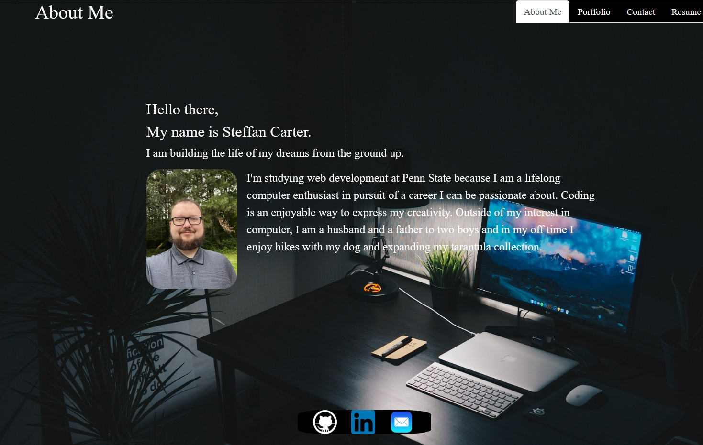

# React Portfolio

## The Task
To create a portfolio using your new React skills, which will help set you apart from other developers whose portfolios don’t use the latest technologies.

## User Story

```md
AS AN employer looking for candidates with experience building single-page applications
I WANT to view a potential employee's deployed React portfolio of work samples
SO THAT I can assess whether they're a good candidate for an open position
```

## Screenshot


## Deployed
[My Portfolio](https://stefcarter.github.io/react-portfolio/)